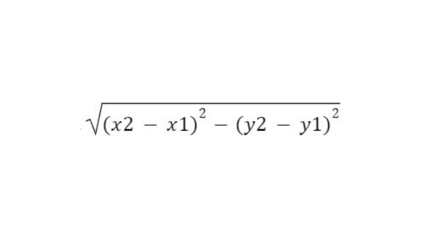
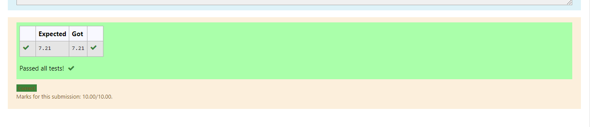

# DISTANCE-BETWEEN-TWO-POINTS

## AIM:
To write a python program to find the distance two 2 points
## ALGORITHM:
### Step 1: Start the program.
### Step 2: Import math module.
### Step 3: 
Substitute the values in the distance formula  
### Step 4: print the values of the distance.
### Step 5: Run the program.
### PROGRAM:
```
import math 
d2=[10,6]
d1=[4,2]
l=math.sqrt(math.pow((d2[1]-d1[1]),2 )+math.pow((d2[0]-d1[0]),2)) 
print('{:.2f}'.format(l))
```
  


### OUTPUT:


### RESULT:
Thus the distance between two points has been calculated.
